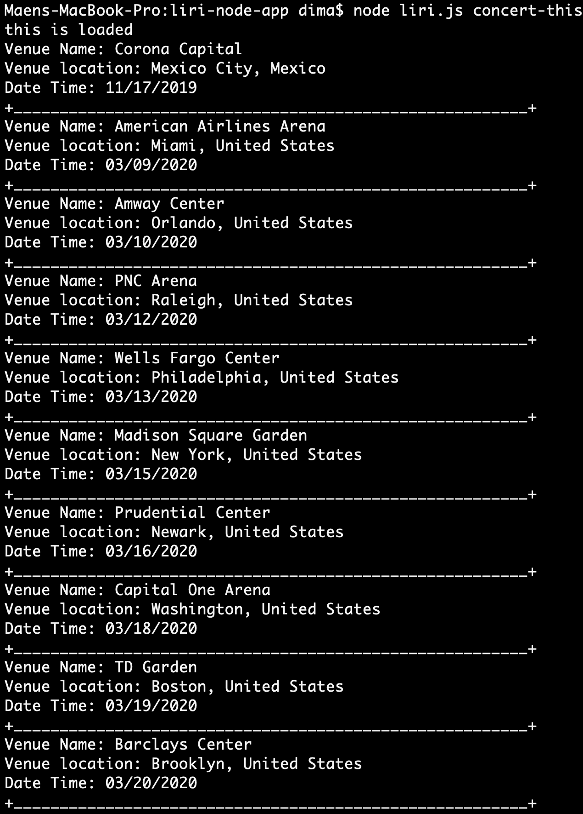
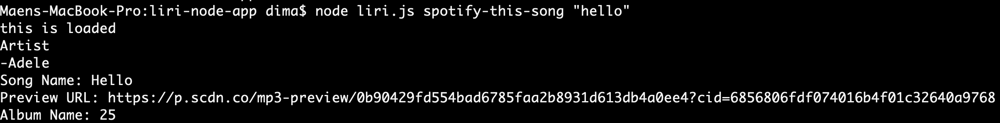
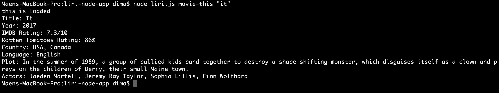

# liri-node-app
liri is a command line bot, that help you to find information about movies, songs and learn more about your favorite artist.  
You can find all your information on the command line and in a file call log.txt.
## How to install Liri:
* Clone this repository.
* Run npm install.
* Enjoy!!.
## How to use Liri:
* Concert-this:
  Type the name of the artist you are interested in, then Liri will give you the information of the concert:
   * Name of the venue. 
   * Venue location .
   * Date of the Event. 
   Example:
   Input:  node liri.js concert-this "billie eilish"
   
   Output: Venue Name: American Airlines Arena
   Venue location: Miami, United States
   Date Time: 03/09/2020
    +________________________________________________________+
   Venue Name: Amway Center
   Venue location: Orlando, United States
   Date Time: 03/10/2020 
   * Sotify-this-song: 
   Type the name of the song you like, then Liri will give you the information of the song:
   *  Artist(s).
   *  The song's name .
   *  A preview link of the song from Spotify.
   *  The album that the song is from.
   Example:
   Input: node liri.js spotify-this-song "hello".
   
   Output:-Adele
   Song Name: Hello
   Preview URL: https://p.scdn.co/mp3-preview/0b90429fd554bad6785faa2b8931d613db4a0ee4?cid=6856806fdf074016b4f01c32640a9768
   Album Name: 25
   If the song could not be found, Liri will show you information about "The Sign" song.
   * Movie-this:
   Type the name of the movie you like, then Liri will give you the information of the movie:
   * Title of the movie.
   * Year the movie came out.
   * IMDB Rating of the movie.
   * Rotten Tomatoes Rating of the movie.
   * Country where the movie was produced.
   * Language of the movie.
   * Plot of the movie.
   * Actors in the movie.
   Example:
   Input: node liri.js movie-this "it"
   
   Output: Title: It
   Year: 2017
   IMDB Rating: 7.4/10
   Rotten Tomatoes Rating: 86%
   Country: USA, Canada
   Language: English
   Plot: In the summer of 1989, a group of bullied kids band together to destroy a shape-shifting monster, which disguises itself as a clown and preys on the children of Derry, their small Maine town.
   Actors: Jaeden Martell, Jeremy Ray Taylor, Sophia Lillis, Finn Wolfhard.
   If you not type a movie name, Liri will show you information about "Mr. Nobody" movie.
   ## Reading Liri commands from file:
   You can write Liri's commands in a file and call it random.text and LIRI will take the text inside of random.txt and then use it to call one of LIRI's commands.
   Example of Random.text:
   spotify-this-song,"I Want it That Way"
   Input: node liri.js do-what-it-says
   Output: Artist
   -Backstreet Boys
   Song Name: I Want It That Way
   Preview URL: https://p.scdn.co/mp3-preview/e72a05dc3f69c891e3390c3ceaa77fad02f6b5f6?cid=6856806fdf074016b4f01c32640a9768
   Album Name: The Hits--Chapter One

